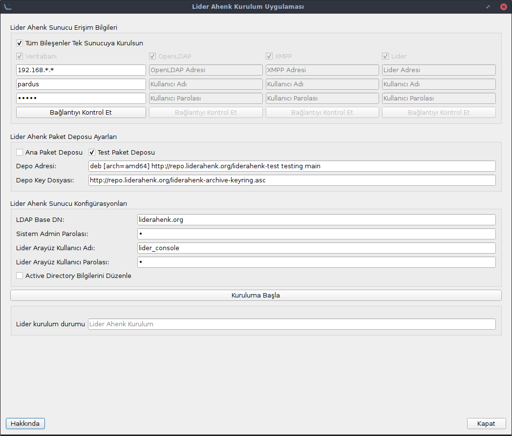
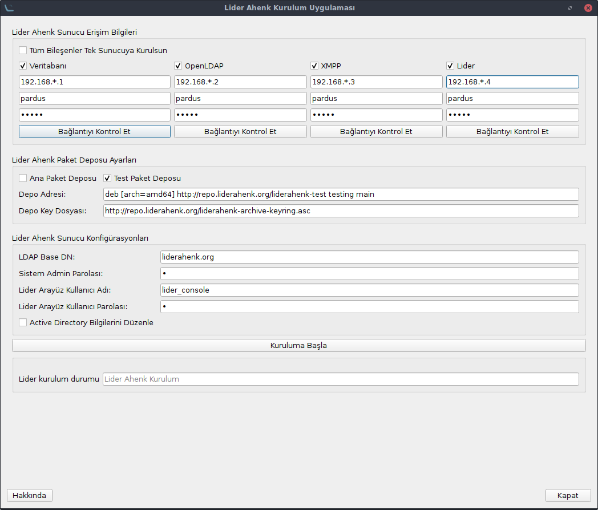
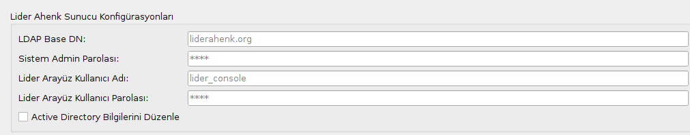

# LİDER AHENK UYGULAMASI NASIL KURULUR


#### Not : Lider Kurulum Uygulamasını Pardus-21.0-GNOME sürümü https://indir.pardus.org.tr/ISO/Pardus21/Pardus-21.0-GNOME-amd64.iso veya Pardus-21.0-XFCE https://indir.pardus.org.tr/ISO/Pardus21/Pardus-21.0-XFCE-amd64.iso sürümü üzerinde çalıştırınız.

#### Not : Lider sunucusu için Pardus-21.0-SERVER sürümünü kullanınız. Pardus-21.0-SERVER sürümünü https://indir.pardus.org.tr/ISO/Pardus21/Pardus-21.0-SERVER-amd64.iso adresinden indirebilirsiniz. Sunucu dilini ingilizce olarak ayarlayınız.

## Bağımlılıkların Kurulması

Uçbirimde aşağıdaki komutlar sırasıyla yazılır.

````
sudo apt-get install python3-paramiko python3-pyqt5 python3-pip python3-psutil xterm 
````
````
pip install mysql-connector-python argon2-cffi
````


## Uygulamanın İndirilmesi

Lider Ahenk Kurulum Uygulamasını indirmek için;

````
sudo apt-get install git
````

komutu ile git paketi yüklenir.

````
git clone https://github.com/Pardus-LiderAhenk/lider-ahenk-installer.git
````

Komutu ile Lider Ahenk Kurulum Uygulaması indirilir.

## Uygulamanın Çalıştırılması

Kurulum uygulamasını çalıştırmak için;

````
cd lider-ahenk-installer/src/
````

komutu ile src dizinine gidilir ve

````
python3 app.py
````

komutu ile kurulum uygulaması çalıştırılır.

##### Not : Uygulamayı çalıştırmadan önce lider ahenk kurulum uygulamasının çalıştırıldığı makinede ve  kurulum yapılacak makinelerde ssh paketi kurulu olmalıdır.

### 1. Lider Ahenk Sunucu Erişim Bilgileri

Lider Ahenk sunucu bileşenlerinin (Veritabanı, OpenLDAP, XMPP ve Lider) hangi sunucu ya da sunuculara kurulucağının belirlendiği alandır. Tüm bileşenler tek sunucuya kurulacaksa "**Tüm Bileşenler Tek Sunucuya Kurulsun**" seçeneği seçilir. 
Aşağıdaki resimde bileşenlerin tek sunucuya kurulması durumu gösterilmiştir.



Bileşenlerin ayrı ayrı sunuculara kurulması istenildiği durumda hangi bileşen kurulcaksa o bileşen seçilir ve erişim bilgileri girilir.
Aşağıdaki resimde bileşenlerin ayrı ayrı sunuculara kurulması durumu gösterilmiştir.



Sunucu erişim bilgileri girildikten sonra "**Bağlantıyı Kontrol Et**" butonuna tıklanarak sunucuya erişim olup olmadığı kontrol edilir.

### 2. Lider Ahenk Deposu Ayarları

Lider Ahenk bileşenlerinin hangi paket deposu kullanılarak kurulması bu menüde gerçekleştirilir. Stable lider ahenk paketleri için Ana Paket Deposu, test lider ahenk paketleri için Test Paket Deposu seçilir.
Depo Key Dosyası: Lider Ahenk paket deposu için oluşturulan anahtar dosyasıyı ifade eder.

**NOT:** Kurulum yapılacak sunucu için paket depoları yerele aynalanmış ise(mirror) Depo Adresi ve Depo Key Dosyası için yerel adresler girilmelidir.
 
### 2. Lider Ahenk Sunucu Konfigürasyonları

Lider Ahenk sunucu konfigürasyonları için aşağıdaki alanların girilmesi gerekmektedir.



**LDAP Base DN:** LDAP temel düğümü,<br>
**Sistem Admin Parolası:** Lider Ahenk bileşenleri için admin yönetici parolası,<br>
**Lider Arayüz Kullanıcı Adı:** Lider arayüzü kullanacak kullanıcı adı (Lider Admini veya Sistem Yönetici), <br>
**Lider Arayüz Kullanıcı Parolası:** Lider arayüzü kullanacak kullanıcı parolası, <br>


**Kuruluma Başla** butonuna tıklanarak Lider Ahenk sunucu kurulumu başlatılır.
