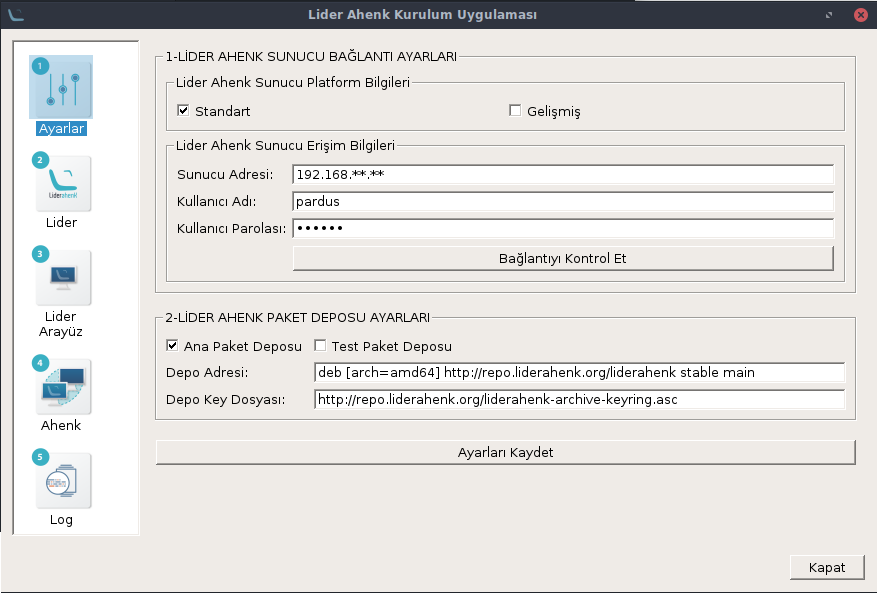
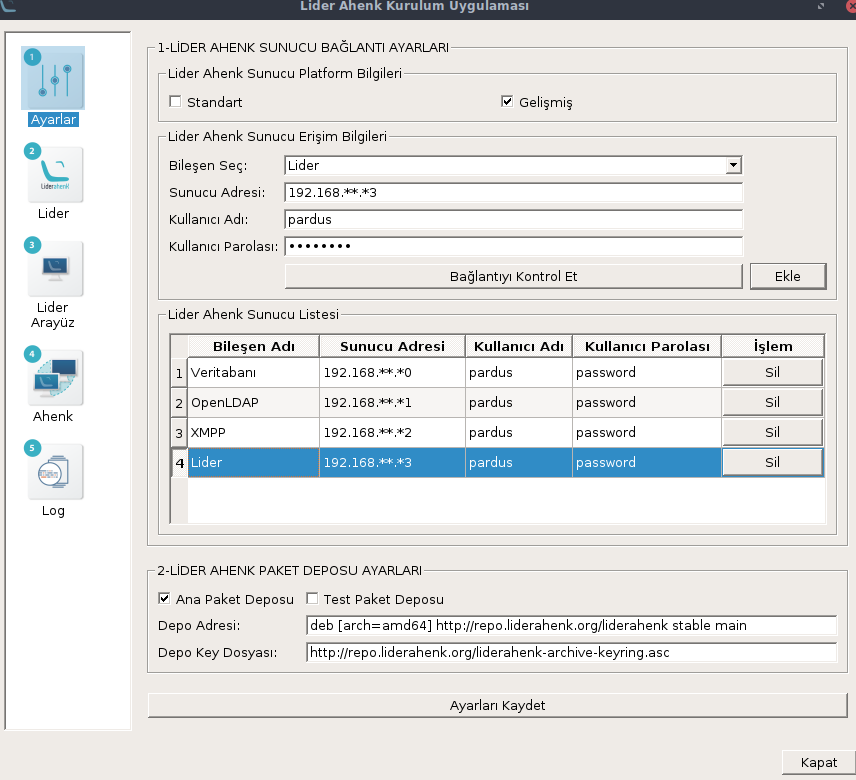
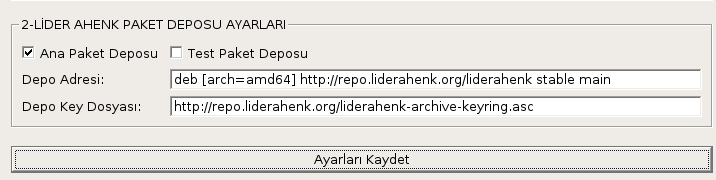
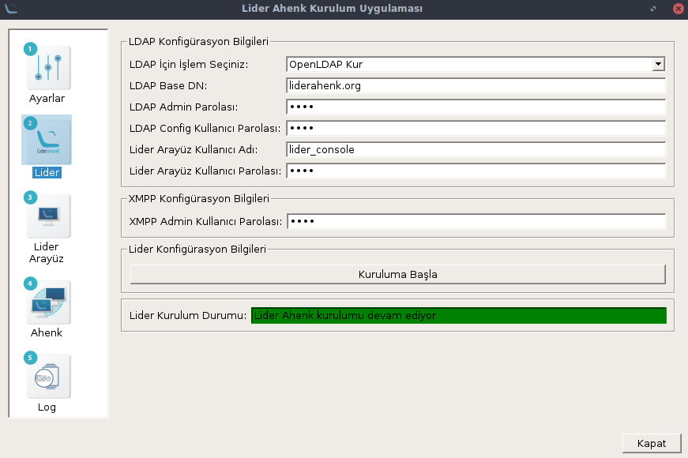
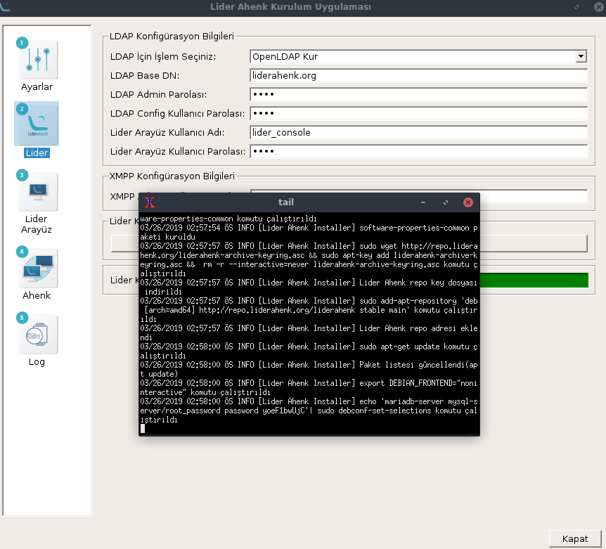
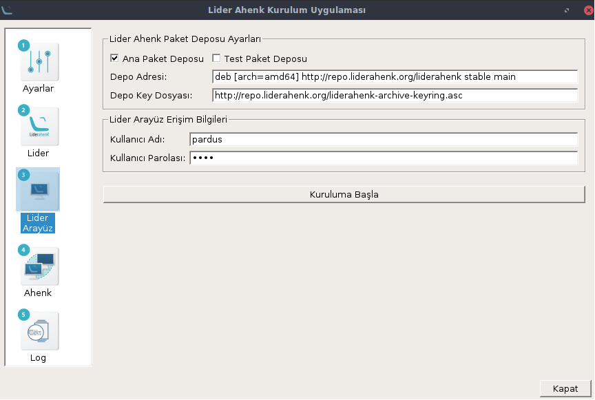
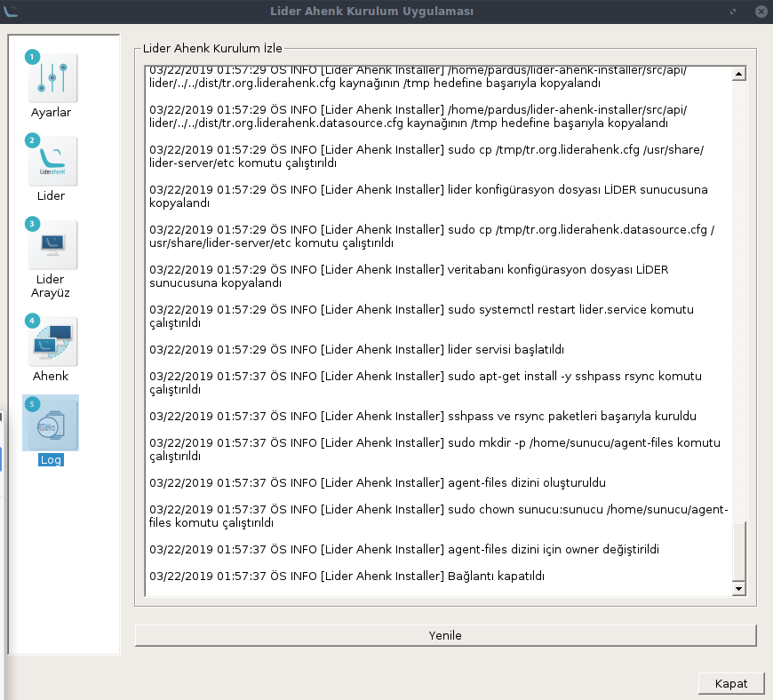

# LİDER AHENK UYGULAMASI NASIL KURULUR

## Bağımlılıkların Kurulması

Uçbirimde aşağıdaki komutlar sırasıyla yazılır.

````
sudo apt-get install python3-paramiko python3-pyqt5 python3-mysql.connector python3-psutil python3-wget xterm maven 
````


## Uygulamanın İndirilmesi

Lider Ahenk Kurulum Uygulamasını indirmek için;

````
sudo apt-get install git
````

komutu ile git paketi yüklenir.

````
git clone https://github.com/Pardus-LiderAhenk/lider-ahenk-installer.git
````

Komutu ile Lider Ahenk Kurulum Uygulaması indirilir.

## Uygulamanın Çalıştırılması

Kurulum uygulamasını çalıştırmak için;

````
cd lider-ahenk-installer/src/
````

komutu ile src dizinine gidilir ve

````
python3 app.py
````

komutu ile kurulum uygulaması çalıştırılır.

##### Not : Uygulamayı çalıştırmadan önce lider ahenk kurulum uygulamasının çalıştırıldığı makinede ve  kurulum yapılacak makinelerde ssh paketi kurulu olmalıdır.

## Menüler

Uygulama solda görüldüğü gibi 4 menüden oluşur.

### 1. Ayarlar Menüsü

Ayarlar menüsü, Lider Ahenk Sunucu Bağlantı Ayarları ve Lider Ahenk Paket Deposu Ayarlarının yapıldığı menüdür.

Lider Ahenk Sunucu Bağlantı Ayarları,
Standart Kurulum ve Gelişmiş Kurulum olmak üzere iki şekilde gerçekleşir.

**Standart Kurulum :** Lider Ahenk Bileşenlerini tek bir makineye kurulmasını sağlar. Sırasıyla; <br>
* Standart Kurulum, <br>
* Lider Ahenk Paket Deposu Ayarları,<br>
* Lider Menüsü,<br>
* Log Menüsü<br>

adımları izlenmelidir.<br>
Standart Kurulum adımları için <a href = "#standart" >**tıklayınız.**</a>

**Gelişmiş Kurulum :** Lider Ahenk Bileşenlerini ayrı makinelere kurulmasını sağlar. Sırasıyla; <br>
* Gelişmiş Kurulum, <br>
* Lider Ahenk Paket Deposu Ayarları,<br>
* Lider Menüsü,<br>
* Log Menüsü<br>

adımları izlenmelidir.<br>
Gelişmiş Kurulum adımları için <a href = "#gelismis" >**tıklayınız.**</a>

##### Not : Standart Kurulum ve Gelişmiş Kurulum 2 ayrı kurulum çeşididir. Kurulum sırasında sadece biri seçilmelidir.


##### Ana Paket Deposu : Geliştirilmelerin tamamlandığı kararlı paket deposudur.

##### Test Paket Deposu : Yeni geliştirmelerin yayınlandığı test paket deposudur.

<p id = "standart"></p>

#### 1.1. Standart Kurulum

Standart Kurulum, Lider Ahenk Sunucu bileşenlerinin (Veritabanı, OpenLDAP, XMPP, Lider) tek bir makineye kurulmasını sağlar.

Standart Kurulum için, Lider Ahenk Sunucu Bağlantı Ayarlarındaki Standart kutucuğuna tıklanır.




Lider Ahenk Sunucu Erişim Bilgileri alanında Lider Ahenk Uygulamasının kurulum yapılacağı makinenin bilgileri girilir. Sunucu adresi kurulum yapılacak makinenin ip bilgisini, kullanıcı adı ve kullanıcı parolası ise kurulum yapılacak makinede bulunan **sudo** yetkili kullanıcıyı ifade etmektedir.


**Bağlantıyı Kontrol Et** butonuna tıklanarak bağlantı durumu kontrol edilir. **Daha sonra Lider Ahenk Paket Deposu Ayarları yapılır. Bunun için <a href = "#ayarlar" >tıklayınız.** </a>

<p id = "gelismis"></p>

#### 1.2. Gelimis Kurulum

Gelişmiş kurulum Lider Ahenk Sunucu bileşenlerinin (Veritabanı, OpenLDAP, XMPP, Lider) ayrı makinelere kurulmasını sağlar.

Gelişmiş kurulum için, Lider Ahenk Sunucu Bağlantı Ayarlarındaki Gelişmiş kutucuğuna tıklanır.



Lider Ahenk Sunucu Erişim Bilgileri alanında bileşen (Veritabanı, OpenLDAP, XMPP, Lider) seçilip, ilgili bileşene ait erişim bilgileri girilir ve **Ekle** butonuna tıklanarak ilgili bileşen Lider Ahenk Sunucu Listesi alanına eklenir. Sunucu adresi kurulum yapılacak makinenin ip bilgisini, kullanıcı adı ve kullanıcı parolası ise kurulum yapılacak makinede bulunan **sudo** yetkili kullanıcıyı ifade etmektedir. **Bağlantıyı Kontrol Et** butonuna tıklanarak bağlantı durumu kontrol edilir. **Daha sonra Lider Ahenk Paket Deposu Ayarları yapılır. Bunun için <a href = "#ayarlar" >tıklayınız.** </a>

<p id = "ayarlar"></p>

#### 1.3. Lider Ahenk Paket Deposu Ayarları

Lider Ahenk Paket Deposu Ayarları, Ana Paket Deposu ve Test Paket Deposu olmak üzere 2 seçenekten oluşur.

Ana Paket Deposu geliştirmelerin tamamlandığı kararlı paket deposudur, Test Paket Deposu ise yeni geliştirmelerin yayınlandğı test paket deposudur.



Kullanılmak istenilen paket deposu seçildikten sonra **Ayarları Kaydet** butonuna tıklanarak bağlantı ayarları ve paket deposu ayarları kaydedilir. Lider Ahenk sunucu konfigürasyon ayarları için **Lider Menüsüne** geçilir.

### 2. Lider Menüsü

Lider menüsü Lider Ahenk sunucu konfigürasyonlarının yapıldığı ve kurulumun başlatıldığı bölümdür.

<br>



Sunucu konfigürasyonu için LDAP konfigürasyon bilgileri ve XMPP konfigürasyon bilgileri girilir. <br>
LDAP İçin İşlem Seçiniz : Yeni kurulacak OpenLDAP için **OpenLDAP Kur**, kurulu OpenLDAP olması durumunda **OpenLDAP Güncelle** seçilmelidir.<br>
LDAP Base DN: LDAP temel düğümü,<br>
LDAP Admin Parolası: LDAP admin yönetici parolası,<br>
LDAP Config Kullanıcı Parolası: LDAP sunucu yapılandırmak için kullanılan şifre,<br>
Lider Arayüz Kullanıcı Adı: Lider arayüzü kullanacak kullanıcı adı (Lider Admini veya Sistem Yönetici), <br>
Lider Arayüz Kullanıcı Parolası: Lider arayüzü kullanacak kullanıcı parolası, <br>
XMPP Admin Kullanıcı Parolası: XMPP admin kullanıcı parolası, <br> girilir.

**Kuruluma Başla** butonuna tıklanarak kurulum başlatılır.



Kurulum devam ediyor. Kurulum Logları açılan XTerm ekranında da takip edilebilir.

Kurulum bittikten sonra Log Menüsünde kurulum detayları görülür.

### 3. Lider Arayüz Menüsü

Lider Arayüz Menüsü, lider ahenk merkezi yönetim sisteminin yönetim uygulama arayüzünün kurulmasını sağlar.



Lider Arayüz, lider ahenk kurulum uygulamasının çalıştırıldığı makineye kurulur.

Lider Ahenk Paket Deposu Ayarları, Ana Paket Deposu ve Test Paket Deposu olmak üzere 2 seçenekten oluşur. Ana Paket Deposu geliştirmelerin tamamlandığı kararlı paket deposudur, Test Paket Deposu ise yeni geliştirmelerin yayınlandğı test paket deposudur.

Kurulmak istenen depo paketi seçildikten sonra, kurulum uygulamasının çalıştırıldığı makinenin **sudo** yetkili kullanıcı adı ve parolası, Erişim Bilgileri alanına girilir.

**Kuruluma Başla** butonuna tıklanarak kurulum başlatılır.


### 4. Ahenk Menüsü

Ahenk Menüsü, istemcileri etki alanına dahil etmek için kullanılan menüdür.


XMPP Sunucu Adresine, sunucunun kurulu olduğu makinenin İP adresi girilir.

Lider Ahenk Paket Deposu Ayarları, Ana Paket Deposu ve Test Paket Deposu olmak üzere 2 seçenekten oluşur. Ana Paket Deposu geliştirmelerin tamamlandığı kararlı paket deposudur, Test Paket Deposu ise yeni geliştirmelerin yayınlandğı test paket deposudur.

Ahenk Kurulacak İstemci Erişim Bilgileri alanına;<br>
İstemci Adresi : Etki alanına dahil edilecek istemci İP adresi, <br>
Kullanıcı Adı : Ahenk kurulacak istemcide bulunan **sudo** yetkili kullanıcı adı,<br>
Kullanıcı Parolası : Ahenk kurulacak istemcide bulunan **sudo** yetkili kullanıcı parolası<br>
girilir.

Bilgiler girildikten sonra **Ekle** butonuna tıklanarak Ahenk Kurulacak İstemci Listesi alanına makine bilgileri eklenir.

Kurulacak makinelerin bilgileri girildikten sonra **Kuruluma Başla** butonuna tıklanarak kurulum başlatılır.

Kurulacak İstemci Listesi alanında kurulum bittikten sonra Ahenk  erişim sağlanan istemcilerin rengi mavi, erişim sağlanamayan istemcilerin rengi ise gri olur.
Kurulum sırasındaki bilgiler Log Menüsünde görülür.


### 5. Log Menüsü

Log Menüsüde ise kurulumda gerçekleşen komutları, bilgileri, hataların görüldüğü menüdür.



**Yenile** butonuna tıklanır kurulum hakkında bilgiler görülür.
